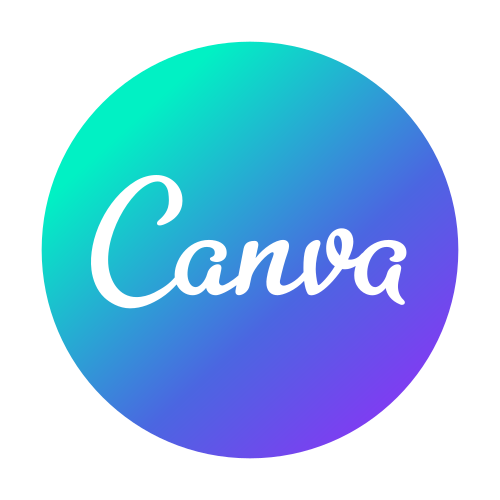
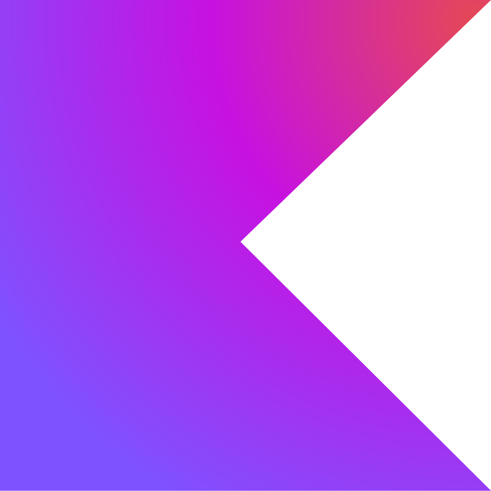
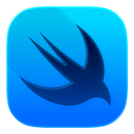

  

    <h1>Welcome to my profile 👋</h1>
    
  

   
   

  <!-- About Me -->
  <h1>About Me</h1>
  

    <h3>I wouldn’t quite describe myself as an interesting guy, but definitely as a passionate one. Solving problems is my specialty and one of my favorite things to do—seriously, if I can’t solve something, I’ll overthink it all day until I find a solution. I love building apps and games—oh boy, THE GAMES! I absolutely love making and playing them. My favorites are:</h3>
    <ul>
      <li>Fallout</li>
      <li>Red Dead Redemption 2</li>
      <li>Cyberpunk 2077</li>
      <li>Days Gone</li>
      <li>Metro</li>
      <li>Battlefield</li>
    </ul>
    <h3>I'm currently studying Systems Analyst and Programmer, Teacher degree and working on a new game. Creator of Lightning Coffee Games, Bizarre Engine and working on Bizarre Engine 2, a Gamemaker framework for everyone.</h3>
  

   
   
   

  <!-- Tech -->
  <h1>Tech Related</h1>
  

    <h3>Well, let's continue this awesome travel called "View my profile" and discover what technologies I use. Oh come on, It will be fun!</h3>
     
     
    

      <h3>Technologies</h3>
      
      
      
      
      
      
      
      
      
      
      
       
       
      <h3>Languages</h3>
      
      
      
      
      
      
      
      
       
       
      <h3>Currently Studying / Future Studies</h3>
      
      
      
      
      
    

  

   
   
   

  <!-- Git Stats -->
  

    <h1>My GitHub Stats Baby 💋</h1>
    
  

   
   

  <!-- End -->
  

    <h3>Want to know more about me? <a href="https://brunoo1545.github.io">Visit my page</a>.</h3>
    <h3>With ❤ from</h3>
    
  

